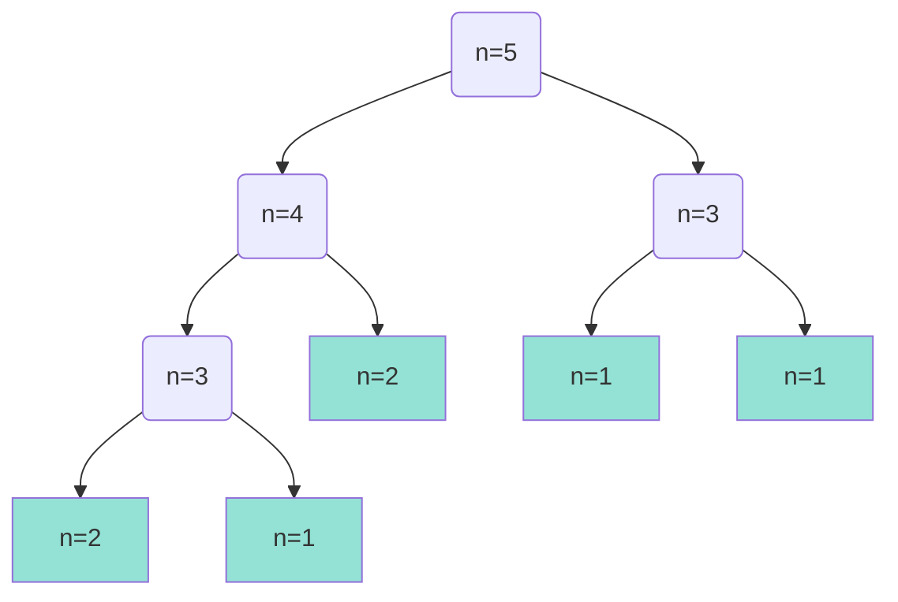

Per cominciare vediamo quali sono alcuni modi per computare la **sequenza di Fibonacci**.
La sua definizione è la seguente:
$$F_n=\begin{cases}1&n=1,2\\F_{n-1}+F_{n-2}&n\geq 3\end{cases}$$
## Sezione aurea - Binet
La **sezione aurea** ($\Phi$) è data dalla soluzione positiva di $x^2=x+1$ ovvero:
$$\frac{1+\sqrt{5}}{2}$$
mentre il suo complemento $\hat{\Phi}$ è dato dalla soluzione negativa:
$$\frac{1-\sqrt{5}}{2}$$
Binet scopre che è possibile calcolare con un solo passaggio l'n-esimo numero della sequenza di Fibonacci con la seguente formula:
$$F_n=\frac{1}{\sqrt{5}}(\Phi^n-\hat{\Phi}^n)$$

---
### Dimostrazione per induzione
- <u>Casi base</u> 
	Se $n=1$
	$$F(1)=\frac{1}{\sqrt{5}}(\frac{1+\sqrt{5}}{2}-\frac{1-\sqrt{5}}{2})=1$$
	Se $n=2$
	$$F(2)=\frac{1}{\sqrt{5}}(\frac{(1+\sqrt{5})^2}{4}-\frac{(1-\sqrt{5})^2}{4})=1$$
- <u>Passo induttivo</u>
	Usando l'ipotesi: $\forall k \leq n-1,\quad F_k=\frac{1}{\sqrt{5}}(\Phi^k-\hat{\Phi}^k)$
	vogliamo dimostrare che anche per $n\geq 3$ la formula di Binet è valida.
	  
	Per definizione:
	$$F_n=F_{n-1}+F_{n-2}=\frac{1}{\sqrt{5}}(\Phi^{n-1}-\hat{\Phi}^{n-1})+\frac{1}{\sqrt{5}}(\Phi^{n-2}-\hat{\Phi}^{n-2})=$$
	$$=\frac{1}{\sqrt{5}}[(\Phi^{n-1}+\Phi^{n-2})-(\hat\Phi^{n-1}+\hat\Phi^{n-2})]$$
	Notiamo che la formula che abbiamo ora è simile a quella di Binet, mi rimane da dimostrare che:
	$$\begin{cases}\Phi^n=\Phi^{n-1}+\Phi^{n-2}\\\hat\Phi^n=\hat\Phi^{n-1}+\hat\Phi^{n-2}\end{cases}$$
	per farlo divido per $\Phi^{n-2}$ e $\hat\Phi^{n-2}$
	$$\begin{cases}\Phi^2=\Phi+1\\\hat\Phi^2=\hat\Phi+1\end{cases}$$
e ottengo la formula di Binet iniziale. $\square$

---

>[!Important]
>L'algoritmo usando la formula di Binet _avrebbe_ complessità pari a 1, teoricamente è corretto ma non disponendo di memoria infinita un computer non è in grado di rappresentare numeri irrazionali con una precisione adeguata, questo porta ad alcuni input che producono risultati sbagliati approssimando il risultato all'intero più vicino.

## Performance dell'algoritmo ricorsivo
L'algoritmo ricorsivo ricalca la definizione della sequenza di Fibonacci:
```cpp
int Fib2(int n) {
	if (n <= 2) return 1;
	else return Fib2(n-1) + Fib2(n-2);
}
```


Le foglie($f$) hanno complessità 1 mentre i nodi intermedi($i$) hanno complessità 2.
$$T(n)=2i(T_n)+f(T_n)$$
$T(5)=2\cdot 4 + 1\cdot 5 = 13$

### Formula chiusa per la performance
>Una formula chiusa consiste in una formula che al suo interno non chiama altri algoritmi.

Con le seguenti proposizioni:
-  $f(T_n)=F_n$ (le foglie sono pari all'ennesimo numero fib.)
- $i(T_n)=F_n-1$ (i nodi intermedi sono uguali alle foglie -1 ma quindi anche a Fib. - 1)

otteniamo che la complessità risulta:
$$T(n)=2(F_n-1)+F_n=3F_n-2$$
E notiamo che le istruzioni aumentano molto velocemente:

| Input | Numero di istruzioni |
|:-----:|:--------------------:|
| T(8)  |          61          |
| T(45) |    3.404.709.508     |


