Un algoritmo viene definito **greedy** se la scelta compiuta durante un'iterazione è basata sulla strada che _sembra_ più **promettente**.

Vari algoritmi greedy che abbiamo incontrato risultano essere:
- [[Kruscal|L'algoritmo di Kruskal]]: prende sempre l'arco leggero
- [[Prim|L'algoritmo di Prim]]: sceglie sempre il vertice con `Key` minore
- [[Dijkstra|L'algoritmo di Dijkstra]]: sceglie sempre il vertice con `d` minore

### Problema della selezione delle attività
Supponiamo di avere $n$ attività indicizzate da $1$ a $n$, di cui si sa l'orario di **inizio** $s_i$ e di **fine** $f_i$.
Siano date due attività $i$ e $j$, esse sono **compatibili** se gli insiemi temporali che occupano sono disgiunti, ovvero:
$$\begin{rcases}
i:[s_i,f_i[\space\\\\
j:[s_j,f_j[\space
\end{rcases}
[s_i,f_i[\space\cap\space[s_j,f_j[=\emptyset\implies i\text{ e } j \text{ sono compatibili}
$$

Si può dire che $i$ e $j$ sono compatibili anche se $f_i\leq s_j$ oppure se $f_j\leq s_i$.

Si vuole determinare il <u>massimo numero di attività tra loro compatibili</u>.
>Un esempio reale può essere l'associazione processi-risorse di un calcolatore.

```mermaid
gantt
    title Attività
    dateFormat X
    axisFormat %s
    section Attività 6
    4   : 16, 20
    section Attività 5
    5   : 11, 16
    section Attività 4
    4   : 11, 15
    section Attività 3
    3   : 8, 11
    section Attività 2
    10   : 4, 14
    section Attività 1
    6   : 1, 7
```



Le attività $1,4,6$ sono compatibili, lo stesso vale per $3,4,6$ oppure $1,5,6$, il numero totale di attività tra loro compatibili è la massimo $3$ per qualsiasi combinazione.

Per trovare il numero massimo di attività compatibili dobbiamo **sceglierne alcune** e **scartarne altre**, ciò ci suggerisce di usare un algoritmo _greedy_.
Per confrontare le attività utilizziamo il tempo di fine, e le ordiniamo rispetto ad esso, in questo modo le attività saranno ordinate come segue:
$$f_i\leq f_2\leq ...\leq f_n$$

```
Greedy_Activity_Selector(s, f)
	n = length[s]
	ordina le n attività per tempo di fine non decrescente
	
	A = 1
	j = 1
	for i = 2 to n
		if s_i >= f_j
			A = A U {i}
			j = i
	return A
```
$s$ ed $f$ sono i vettori di inizio e fine attività, $A$ è l'insieme delle attività massime, e $j$ una variabile ausiliaria che indica quale è stata l'ultima attività inserita in $a$.
Il costo è dato dall'ordinamento e dal ciclo for: $T(n)=O(n\log n+n)=O(n\log n)$.

**Ordinamento per durata**:

```mermaid
gantt
    title Attività
    dateFormat X
    axisFormat %s
    section Attività 7
    3   : 13, 16
    section Attività 6
    5   : 14, 19
    section Attività 5
    3   : 8, 11
    section Attività 4
    5   : 9, 14
    section Attività 3
    3   : 3, 6
    section Attività 2
    14   : 5, 9
    section Attività 1
    4   : 1, 5
```



lasciando invariato l'algoritmo precedente, esso ritornerebbe le attività $1,2,4,6$ le quali sono $4$ e rappresentano il numero massimo di attività tra loro compatibili, ma se modificassimo il **criterio di ordinamento** e le ordinassimo rispetto la loro **durata** esso prenderebbe in considerazione le attività $3,5,7$ e questo insieme _non_ rappresenta il risultato corretto.

**Ordinamento per tempo d'inizio**:

```mermaid
gantt
    title Attività
    dateFormat X
    axisFormat %s
    section Attività 5
    4   : 15, 19
    section Attività 4
    3   : 12, 15
    section Attività 3
    6   : 6, 12
    section Attività 2
    4   : 2, 6
    section Attività 1
    18   : 1, 19
```



se l'ordinamento fosse basato sul **tempo d'inizio** crescente, allora, dato che la prima attività ad essere considerata è la prima, l'algoritmo ritornerebbe $A=\{1\}$, che contiene un solo elemento, che è sbagliato in quanto il numero massimo di attività compatibili tra loro è, anche in questo caso, $4$, ovvero: $2,3,4,5$.

### Struttura comune degli algoritmi greedy
1. `Sort` (secondo un criterio a nostra discrezione)
2. `A = ∅` (inizializzazione strutture dati)
3. `for each element x` preso secondo l'ordine stabilito
	4. `if A U {x}` controllo sulla condizione cercata
	5. `A = A U {x}` aggiunta dell'elemento che soddisfa la condizione
6. `return A`

>Questo rappresenta un **metodo** non un algoritmo in quanto le istruzioni non sono precise, e sono infatti a descrizione dello sviluppatore.

### Problema della clique massima
Implementiamo un algoritmo che trovi la [[Isomorfismo#Clique|clique massima]] da un grafo $G$ in input:
```
Is_A_Clique(C, u)
	for each v in C
		if (u, v) not in E
			return false
	return true

Greedy_Clique(G)
	ordina i vertici di G secondo il grado
	C = ∅
	
	per ogni vertice u di G estratto secondo l'ordinamento
		if Is_A_Clique(C, u)
			C = C U {u}
	return C
```

La complessità, considerando che `Is_A_Clique` esegue al massimo $n$ iterazioni, è:
$$T(n)=O(n\log n+n^2)=O(n^2)$$
per come è costruito l'insieme $C$, il risultato è **sicuramente una clique** ma **non è detto che sia massima**.
![[Is clique-1.svg]]

L'algoritmo estrarrebbe il vertice $1$ e poi il vertice $7$, e questi due vertici formano una _clique_, ma non massima, l'algoritmo poi continua ad estrarre gli altri vertici ma nessuno formerà una clique assieme ai vertici $\{1,7\}$ per cui l'algoritmo alla fine ritornerà $\{1,7\}$, quando in realtà questi due vertici formando una **clique massimale** e **non massima**, la _clique massima_ è data da: $7,8,9$.

Per verificare che non è colpa del criterio di ordinamento se l'algoritmo non funziona, introduciamo il concetto di **triangolo**, ovvero una clique formata da $3$ vertici (formeranno un ciclo).

Estraendo i vertici in ordine decrescente di numero di _triangoli_ incidenti sul grafo precedente, l'algoritmo funzionerebbe, in quanto solo i vertici $7,8,9$ sono incidenti ad un triangolo, ma è facile dimostrare con un controesempio che questa idea non è corretta:
![[Is clique-2.svg]]

L'algoritmo estrarrebbe e terrebbe solamente i vertici $1,7$, mentre la _clique massima_ è data dai vertici $7,8,9,10$.

>[!Question] Problema NP-Completo
>È inverosimile che un algoritmo polinomiale possa risolvere questo problema, tuttavia non lo si sa ancora per certo.
>
>Questo problema rientra nella categoria dei problemi **NP-Completi**.

