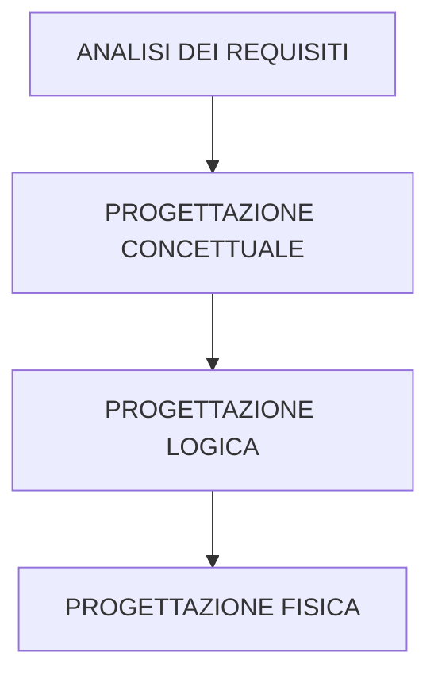

Un **modello astratto** è la rappresentazione formale di idee e conoscenze relative ad un fenomeno.

## Modellazione concettuale
- **Entità**: sono ciò di cui interessa rappresentare alcune proprietà, può essere anche una <u>collezione</u> di entità uguali (e.g. studenti)
- **Proprietà**: sono fatti che descrivono caratteristiche delle entità, in particolare è una _coppia_ <Attributo, valore> e può essere:
	- atomica (e.g. nome)
	- strutturata (e.g. indirizzo residenza)
	- multivalore (e.g recapiti telefonici)

>Spesso le _collezioni_ rappresentano **specializzazioni/generalizzazioni** (e.g. utenti => studenti, docenti) dove una collezione specializzata è un sottoinsieme che possiede le proprietà della superclasse (collezione da cui eredita proprietà)

### Associazioni
Una associazione <u>lega più collezioni tra loro</u> dove il **dominio** è dato dal prodotto cartesiano delle due collezioni, ed è caratterizzata dalle seguenti proprietà strutturali:

- **Cardinalità** (o molteplicità) considerando gli insiemi X e Y può essere:
	- **1:1**: ogni elemento x è associato al massimo 1 elemento di Y e viceversa
	- **1:N**: ogni elemento x può avere più associazioni verso gli elementi di Y, ma gli elementi y possono avere solo 1 associazione con con elementi di X
	- **N:1**: ogni elemento x può avere al massimo 1 associazione con 1 elemento di Y, ma gli elementi y possono avere più associazioni con elementi di X
	- **N:M**: ogni elemento di X e Y può avere più associazioni verso elementi dell'altro insieme

Con il **vincolo di univocità** definiamo un'associazione <u>univoca da X a Y</u> se ogni elemento x è associato _al massimo_ ad un elemento di Y altrimenti è <u>multivalore</u>.

Con il **vincolo di totalità** definiamo un'associazione <u>totale da X a Y</u> se ogni elemento x è associato ad _almeno_ un elemento di Y, altrimenti è <u>parziale</u>.

>[!Example]
>- **NataA(Persone, Città)**
>	(N:1), totale su Persone e parziale su CIttà
>- **HaVisitato(Persone, CIttà)**
>	(N:M), parziale su entrambe
>- **SindacoDi(Persone, CIttà)**
>	(1:1), parziale su entrambe

### Vincoli di integrità
I **vincoli di integrità** sono usati per applicare <u>restrizioni</u> su possibili valori e sui modi in cui essi possono evolvere nel tempo, possono essere:
- **Statici**: definiscono condizioni sui valori indipendentemente da come evolveranno (e.g. età deve essere un intero positivo)
- **Dinamici**: definiscono condizioni sul modo in cui i valori potranno evolversi (e.g. DataNascita non può essere cambiata)
