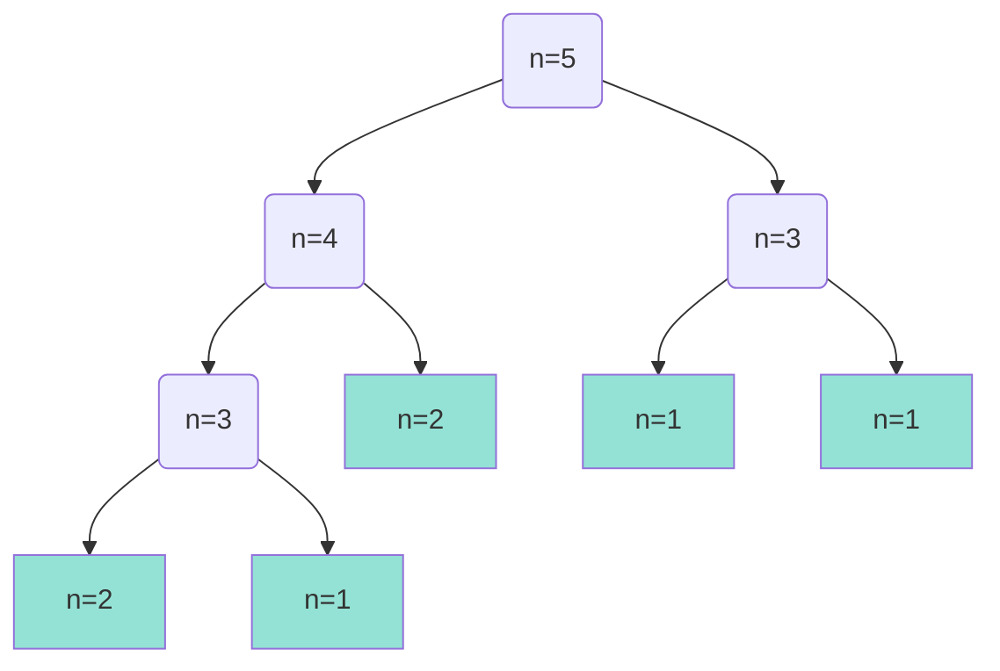

Per cominciare vediamo quali sono alcuni modi per computare la **sequenza di Fibonacci**.
La sua definizione è la seguente:
$$F_n=\begin{cases}1&n=1,2\\F_{n-1}+F_{n-2}&n\geq 3\end{cases}$$
## Sezione aurea - Binet
La **sezione aurea** ($\Phi$) è data dalla soluzione positiva di $x^2=x+1$ ovvero:
$$\frac{1+\sqrt{5}}{2}$$
mentre il suo complemento $\hat{\Phi}$ è dato dalla soluzione negativa:
$$\frac{1-\sqrt{5}}{2}$$
Binet scopre che è possibile calcolare con un solo passaggio l'n-esimo numero della sequenza di Fibonacci con la seguente formula:
$$F_n=\frac{1}{\sqrt{5}}(\Phi^n-\hat{\Phi}^n)$$

---
### Dimostrazione per induzione
- <u>Casi base</u> 
	Se $n=1$
	$$F(1)=\frac{1}{\sqrt{5}}(\frac{1+\sqrt{5}}{2}-\frac{1-\sqrt{5}}{2})=1$$
	Se $n=2$
	$$F(2)=\frac{1}{\sqrt{5}}(\frac{(1+\sqrt{5})^2}{4}-\frac{(1-\sqrt{5})^2}{4})=1$$
- <u>Passo induttivo</u>
	Usando l'ipotesi: $\forall k \leq n-1,\quad F_k=\frac{1}{\sqrt{5}}(\Phi^k-\hat{\Phi}^k)$
	vogliamo dimostrare che anche per $n\geq 3$ la formula di Binet è valida.
	  
	Per definizione:
	$$F_n=F_{n-1}+F_{n-2}=\frac{1}{\sqrt{5}}(\Phi^{n-1}-\hat{\Phi}^{n-1})+\frac{1}{\sqrt{5}}(\Phi^{n-2}-\hat{\Phi}^{n-2})=$$
	$$=\frac{1}{\sqrt{5}}[(\Phi^{n-1}+\Phi^{n-2})-(\hat\Phi^{n-1}+\hat\Phi^{n-2})]$$
	Notiamo che la formula che abbiamo ora è simile a quella di Binet, mi rimane da dimostrare che:
	$$\begin{cases}\Phi^n=\Phi^{n-1}+\Phi^{n-2}\\\hat\Phi^n=\hat\Phi^{n-1}+\hat\Phi^{n-2}\end{cases}$$
	per farlo divido per $\Phi^{n-2}$ e $\hat\Phi^{n-2}$
	$$\begin{cases}\Phi^2=\Phi+1\\\hat\Phi^2=\hat\Phi+1\end{cases}$$
e ottengo la formula di Binet iniziale.

---

>[!Important]
>L'algoritmo usando la formula di Binet _avrebbe_ complessità pari a 1, teoricamente è corretto ma non disponendo di memoria infinita un computer non è in grado di rappresentare numeri irrazionali con una precisione adeguata, questo porta ad alcuni input che producono risultati sbagliati approssimando il risultato all'intero più vicino.

## Algoritmo ricorsivo
L'algoritmo ricorsivo ricalca la definizione della sequenza di Fibonacci:
```cpp
int Fib2(int n) {
	if (n <= 2) return 1;
	else return Fib2(n-1) + Fib2(n-2);
}
```


Le foglie($f$) hanno complessità 1 mentre i nodi intermedi($i$) hanno complessità 2.
$$T(n)=2i(T_n)+f(T_n)$$
$T(5)=2\cdot 4 + 1\cdot 5 = 13$

### Formula chiusa per la performance
>Una formula chiusa consiste in una formula che al suo interno non chiama altri algoritmi.

Con le seguenti proposizioni:
1. $f(T_n)=F_n$ (le foglie sono pari all'n-esimo numero fib.)
	**Dimostrazione prop. 1**
	- <u>Caso base</u>:
		Per $n=1$ e $n=2$ abbiamo che le foglie sono pari all'n-esimo numero fib.
		Ovvero l'unico nodo è anche una foglia appunto: fib(1)=fib(2)=1.
	- <u>Passo induttivo</u>:
		Per $n \geq 3$ dato che l'albero sarà costituito da altri due sottoalberi corrispondenti alle chiamate $(n-1)$ e $(n-2)$ possiamo dire che i nodi foglia è uguale alla somma delle foglie dei sottoalberi, ovvero $F_{n-1}+F_{n-2}$ verificando così la prima prop.

2. $i(T_n)=F_n-1$ (i nodi intermedi sono uguali alle foglie -1 ma quindi anche a Fib. - 1)
	**Dimostrazione prop. 2**
	- <u>Caso base</u>:
		Per $n=1$ e $n=2$ avremo solo un nodo foglia quindi $1-1=0$ nodi intermedi il che verifica il caso base.
	- <u>Passo induttivo</u>:
		Indichiamo con $\hat{T}$ l'albero originale a cui sono state tolte due foglie (con stesso padre) e usiamo _l'ipotesi induttiva_: $i(\hat{T})=f(\hat{T})-1$ per dimostrare la prop. ($i(T)=f(T)-1$)

		Ora il padre delle due foglie rimosse è una foglia lui stesso, quindi noto che:
		$$\begin{cases}i(T)=i(\hat{T})+1\\f(T)=f(\hat{T})+1\end{cases}$$
		sfruttando _l'ipotesi induttiva_ e le due equazioni del sistema ottengo:
		$$i(T)\quad =\quad i(\hat{T})+1=f(\hat{T})-1+1=f(\hat{T})\quad=\quad f(T)-1$$
		verificando così la seconda prop.

Otteniamo che la complessità risulta:
$$T(n)=2(F_n-1)+F_n=3F_n-2$$
E notiamo che le istruzioni aumentano molto velocemente:

| Input | Numero di istruzioni |
|:-----:|:--------------------:|
| T(8)  |          61          |
| T(45) |    3.404.709.508     |

3. Un'altra proprietà dice che: $\forall n \geq 6:\space F_n\geq 2^{\frac{n}{2}}$ 
	**Dimostrazione prop. 3**
	- <u>Caso base</u>:
		Per $n=6$ otteniamo $F_6=8\geq 2^3$  verificando così il caso base.
	- <u>Passo induttivo</u>:
		Usando la definizione di Fibonacci ($F_n=F_{n-1}+F_{n-2}$)e l'ipotesi iniziale ottengo:
		$$F_n\geq2^{\frac{n-1}{2}}+2^{\frac{n-2}{2}}$$
		elaborando la seconda parte della disuguaglianza:
		$$2^{\frac{n}{2}}\cdot 2^{-\frac{1}{2}}+2^{\frac{n}{2}}\cdot 2^{-1}\quad = \quad 2^{\frac{n}{2}}(2^{-\frac{1}{2}}+2^{-1})$$
		noto che il numero all'interno delle parentesi è $\geq 1$ per cui il prodotto sarà obbligatoriamente $\geq 2^{\frac{n}{2}}$ verificando così la terza proposizione.

## Versioni iterative
```
int Fib3(int n)
1. Alloco spazio per un array (F) che possa contenere n interi
2. F[1] = F[2] = 1 // 1 è il primo elemento dell'array, non 0 per semplicità
3. for i = 3 to n
4.    F[i] = F[i-1] + F[i-2]
5. return F[n]
```

L'algoritmo è corretto dato che rispetta la definizione di Fibonacci, la complessità la calcoliamo notando che **3** istruzioni (1, 2, 5) vengono sempre eseguite, il corpo del for verrà eseguito $n-2$ volte mentre il controllo una volta in più, ovvero $n-1$ volte quindi:
$$T(n)=3+(n-2)+(n-1)=2n$$
la complessità è lineare sia spaziale che temporale.

Se dovessimo ottimizzare quest'ultima versione, al posto di usare un array, potremmo usare tre variabili.
```
int Fib4(int n)
1. a = 1; b = 1
2. for i = 3 to n
3.    c = a + b
4.    a = b
5.    b = c
6. return c
```

In questo caso l'algoritmo è corretto, ha una complessità temporale lineare mentre occupa sempre lo stesso spazio (tre variabili) per cui la complessità spaziale è costante

#### Confronto
| Versione | Correttezza | Complessità temporale | Complessità spaziale |
|:--------:|:-----------:|:---------------------:|:--------------------:|
|   Fib1   |     NO      |       Costante        |       Costante       |
|   Fib2   |     SI      |     Esponenziale      |       Lineare        |
|   Fib3   |     SI      |        Lineare        |       Lineare        |
|   Fib4   |     SI      |        Lineare        |       Costante       |
